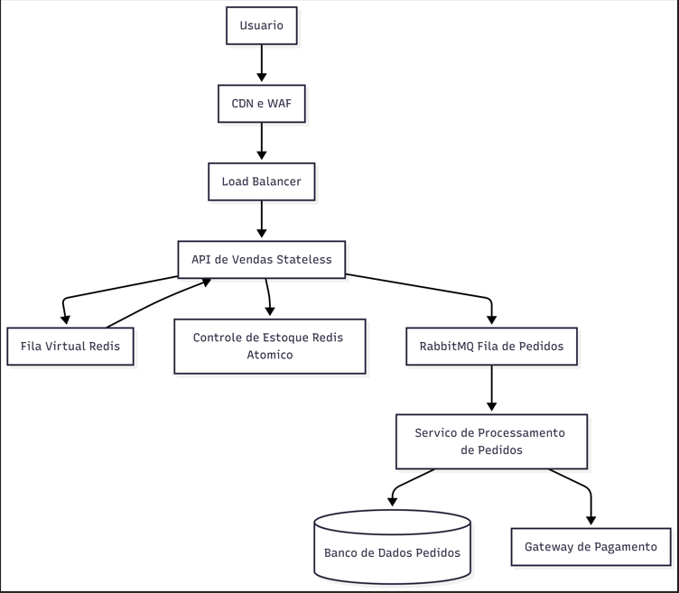

Código mermaid do fluxo

flowchart TD

    U[Usuario] --> CDN[CDN e WAF]
    CDN --> LB[Load Balancer]

    LB --> API[API de Vendas Stateless]

    API --> Queue[Fila Virtual Redis]
    Queue --> API

    API --> Stock[Controle de Estoque Redis Atomico]

    API --> MQ[RabbitMQ Fila de Pedidos]

    MQ --> OrderProcessor[Servico de Processamento de Pedidos]

    OrderProcessor --> DB[(Banco de Dados Pedidos)]

    OrderProcessor --> Payment[Gateway de Pagamento]
    
